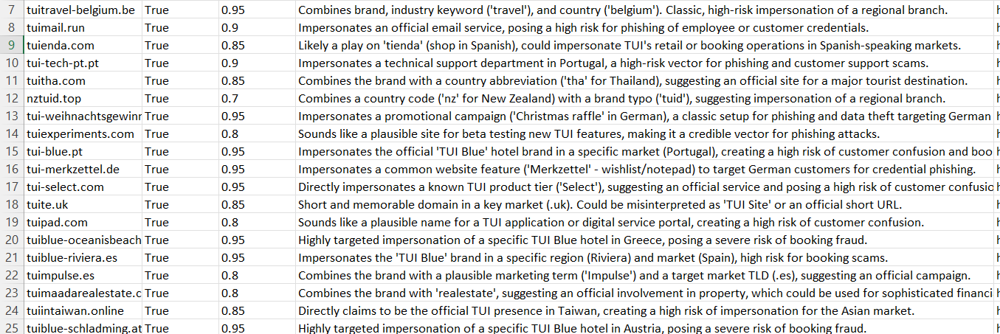

# AI Brand Protection Analyst Agent

A semantic brand protection agent powered by Google's Gemini AI. This tool helps detect fraudulent, malicious, or brand-abusing domains across the internet using advanced LLM-based semantic analysis and customizable analyst personas.

---

## Motivation

After years working with threat intelligence and brand protection products, I've reverse-engineered some truly "creative" evaluation techniques.  
The most memorable: a major platform that hard-cuts domain feeds, discarding any domain that doesn't start with the brand name.

For short brand names like **"tui"** or **""otto"**, this approach loses **millions of potentially threatening domains weekly**.  
Domains like `secure-tui-login[.]com` or `my-tui-booking[.]net` never reach analyst desks because they fail a basic syntax check.

This project was born from the need to **think semantically**, **detect beyond keywords**, and empower analysts with **LLM-driven threat detection**.

---

## Features

- 🔍 **Semantic Threat Detection** — Detects impersonation, phishing, and domain abuse based on brand context on a large scale.
- 🧠 **Analyst Modes** — Choose between junior, senior, and expert AI analyst personas.
- 📦 **Batch Processing** — Efficiently handles large domain datasets via Gemini API.
- 📊 **Structured Output** — Saves results with confidence scores, risk levels, and explanations.
- 🔐 **Flexible API Key Handling** — Use command-line, environment variables, `.env`, or secure prompt.



---

## Installation

1. Clone the repo:

```bash
git clone https://github.com/PAST2212/brand-protection-analyst-agent.git
cd brand-protection-analyst-agent
```

2. Install dependencies:

```bash
pip install -r requirements.txt
```

3. Generate an API Key for Gemini 2.5 Pro Model from here: https://aistudio.google.com/apikey  

4. Add your Gemini 2.5 Pro API key:

- Option 1: via `.env` file

```bash
echo "GEMINI_API_KEY=your_actual_api_key_here" > .env
```

- Option 2: via environment variable

```bash
export GEMINI_API_KEY=your_actual_api_key_here
```

- Option 3: pass via CLI (`--api-key`)

---

## Updating

```bash
cd brand-protection-analyst-agent
git pull
```

If you encounter a merge error:
```bash
git reset --hard
git pull
```

---

## Usage

### Overview of different available commands

```bash
python main.py --help
```

### Examples

```bash
# Basic analysis
python main.py --domains tui.txt --brand-name "tui"

# With custom output
python main.py --domains tui.txt --brand-name "tui" --output tui_analysis.csv

# Advanced analysis
python main.py --domains tui.txt --brand-name "tui"   --company-name "TUI AG"   --industry "Travel & Tourism"   --description "TUI AG (trading as TUI Group) is a German multinational leisure, travel and tourism company; it is the largest such company in the world. It fully or partially owns several travel agencies, hotel chains, cruise lines and retail shops as well as five European airlines. TUI is an acronym for Touristik Union International (Tourism Union International). It is headquartered in Hanover, Germany"   --batch-size 500   --analyst junior   --output tui_results.csv
```

---

## Default Values

| Argument      | Default     |
|---------------|-------------|
| `--batch-size`| `200`       |
| `--analyst`   | `senior`    |

---

## Analyst Modes

| Mode   | Description                                                                  |
|--------|------------------------------------------------------------------------------|
| junior | Entry-level analyst. Consistent, rule-based, deterministic pattern detection.|
| senior | Balanced reasoning. Slightly creative with nuanced evaluation. (default)     |
| expert | Advanced threat detection. High pattern recognition and semantic flexibility.|

---

## Domain File and Output Files

### Input Domain Files

1. Place domain files in `data/` folder
2. Use `.txt` format with one domain per line
3. Example:
   ```
   data/
   ├── tui.txt
   ├── otto.txt
   └── gea.txt
   ```

### Output Files

All output files are stored in the `data/` folder and include:

- `*_threats.csv` — Identified threat domains
- `*_filtered.csv` — Domains considered safe
- `*_complete.json` — Full analysis report

Each `.csv` contains:

- Domain
- Confidence score
- Relevance
- Risk level (`low`, `medium`, `high`)
- Explanation

---

## API Rate Limits

> Gemini API rate limits: [Gemini Rate Limits](https://ai.google.dev/gemini-api/docs/rate-limits)

---

## Notes

- [Google Gemini 2.5 Pro](https://cloud.google.com/vertex-ai/generative-ai/docs/models/gemini/2-5-pro)
- Python 3.10+
- Input and Output files are handled in the `data/` folder
- Only fulltext domain matches are considered
- Use your current domain monitoring provider for domain data source input or others like my other project: [domainthreat](https://github.com/PAST2212/domainthreat)
- Some example results are saved in `data/tui_results_threats.csv`

---

## TODO

- IDN support

---

## Author

**Patrick Steinhoff**  
🔗 [LinkedIn](https://www.linkedin.com/in/patrick-steinhoff-168892222/)

---

## Disclaimer

This tool is intended for **research, legal and security analysis purposes only**.
